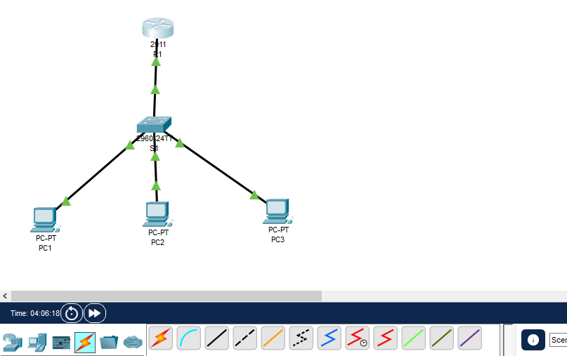

# Enterprise-Network-VLAN-DHCP

## 📌 Project Overview

This is a hands-on enterprise networking project designed and implemented using Cisco Packet Tracer.

The project demonstrates VLAN segmentation, DHCP configuration, Router-on-a-Stick, 802.1Q trunking, and inter-VLAN routing.

## 🖥️ Network Topology

The network consists of:

- 1 Cisco 2911 Router (R1)
- 1 Cisco 2960-24TT Switch (S1)
- 3 PCs

### Topology

R1 → S1

S1 → PC1 (ADMIN)  
S1 → PC2 (IT)  
S1 → PC3 (GUEST)



## 🌐 VLAN Configuration

| VLAN | Name | Network | Gateway |
|------|------|---------|---------|
| 10 | ADMIN | 192.168.10.0/24 | 192.168.10.1 |
| 20 | IT | 192.168.20.0/24 | 192.168.20.1 |
| 30 | GUEST | 192.168.30.0/24 | 192.168.30.1 |

## 🔧 Technologies Used

- Cisco Packet Tracer
- Cisco 2911 Router
- Cisco 2960 Switch
- VLANs
- 802.1Q Trunking
- Router-on-a-Stick
- Inter-VLAN Routing
- DHCP
- IPv4 Addressing

## ⚙️ Configuration

### Router-on-a-Stick

R1 was configured with subinterfaces for each VLAN:

- G0/0.10 → VLAN 10
- G0/0.20 → VLAN 20
- G0/0.30 → VLAN 30

802.1Q encapsulation was configured for each VLAN.

### DHCP

DHCP pools were configured on R1 for all three VLANs.

Each PC automatically receives an IP address from its corresponding VLAN network.

## 🧪 Testing and Verification

The following commands were used to verify the network:

```text
show vlan brief
show interfaces trunk
show ip interface brief
show ip dhcp binding
ipconfig
ping
